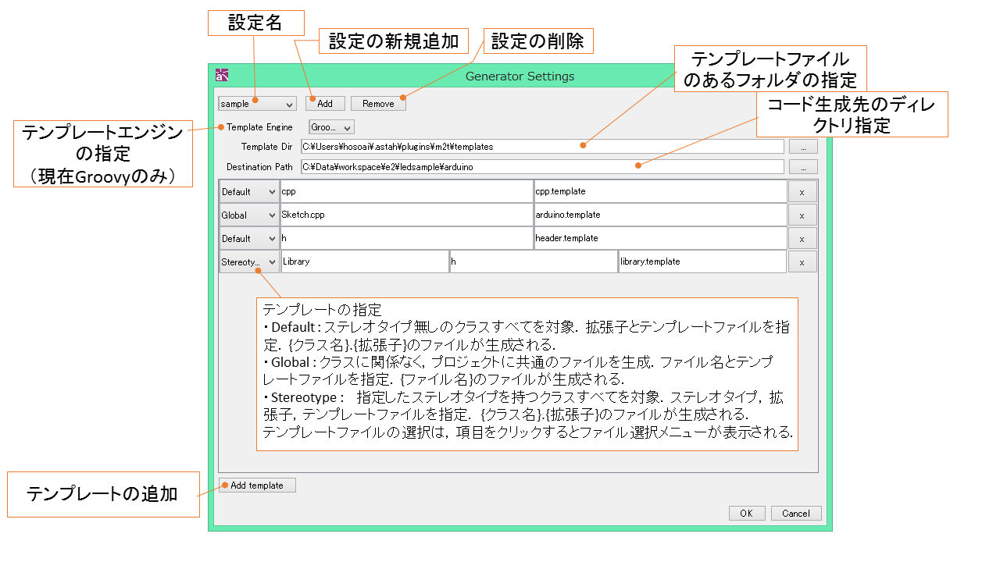

# memo
　- ステートマシンの構造を変更．TransitionはEventを受けて遷移するように．
 - 出来れば汎用的なUtilとプロジェクトローカルなUtilを分けたい．
 - テンプレートエンジン周りを整理
 - Generateをボタン実装
 - [done] Setting ManagerでGeneratorSettingのXML保存，復帰部を

# astah m2t(Model to Text)

## 概要
Astahで汎用的なコード生成を行うためのプラグインです．
GroovyのSimpleTemplateEngineを利用してコード生成を行います．
コード生成のパターンは以下の3種類を用意しています．基本的にプロジェクトが持つ全クラスを対象に生成が行われます．
条件にマッチするクラスに対して，GroovyのSimpleTemplateEngineの記法に沿ったテンプレートファイルを指定します．

 - Default      ：　ステレオタイプの無いクラスを対象にコード生成を行います．
 - Stereotype   ：　ステレオタイプごとにテンプレートを指定します．
 - Global       :　クラスごとではなく，プロジェクトに共通のコードを生成します．

## インストール
### プラグインのインストール
 - ヘルプ＞プラグイン一覧
  + ＋インストール
  + →プラグインファイルを選択 (astahm2t/target/～.jar）
  + →ついでに，Astah SDKフォルダの/astah-plugin-SDK-1.2/bundles/console-1.0.1.jarも

Astah再起動

### 設定フォルダ・設定ファイルの生成
プラグイン用のフォルダが生成されていない場合，初回の起動時に下記フォルダとサンプル類が生成されます．

 - Windows
　C:/Users/{username}/.astah/plugins/m2t/
 - Mac
　UserHome?/.astah/plugins/m2t/

## 利用方法
プラグインがインストールされると，ツールメニューの一番下にm2tメニューが追加されます．
m2tメニューには，Generate（現在の設定でコード生成）とSettings（コード生成の設定）が含まれます．

### 設定
Settingを開いて，コード生成の設定を行いましょう．

設定名の箇所で，現在の生成設定を指定します．新たに追加する場合はAdd, 現在の設定を削除する場合はRemoveをクリックしてください．  
テンプレートフォルダはデフォルトでは上記の設定フォルダ下のtemplates/になっています．別途指定したい場合は変更してください．（複数のテンプレートを管理する場合は，templatesフォルダ下に
設定ごとのフォルダを作成して，テンプレートを保存した方がよいでしょう）    
生成先はデフォルトではユーザディレクトリとなっています．生成したいディレクトリに変更してください．  
テンプレートのマッピングは，ステレオタイプを指定しないものは，Default，指定するものはStereotype, プロジェクトに共通のファイルはGlobalで指定します．    

### 生成テスト
~/.astah/plugins/m2t/sampleDiagram下にサンプルのAstahファイルがあります．
とりあえず試してみたい場合は，こちらを試してみてください．

一応どのファイルと設定の組み合わせでも生成は可能ですが，以下の組み合わせを想定しています．
・JavaSample -> 設定名Java  
・Sample -> 設定名LED-Camp

## テンプレートファイルの作成
テンプレートの作成は，GroovyのSimpleTemplateEngineの記法で行います．
[http://www.groovy-lang.org/templating.html#_simpletemplateengine](http://www.groovy-lang.org/templating.html#_simpletemplateengine)

またテンプレートファイルには，以下の変数が渡されています．

・u : Utility Class(クラスやその他もろもろを詰め込んだユーティリティクラスです．）
ユーティリティからは下記の各属性にアクセスできます．

例えば，クラス名を生成したい場合は，${u.name}と記述します．Java風にクラス定義を記述するのであれば，
java.template

    public class ${u.name} {
    
    }

とすれば，クラスのひな形が生成されます．

### 変数アクセス
変数に含まれる文字列を展開する場合，${変数名}といった記法でアクセスします．
getterメソッドがある場合は，getを省略した形でアクセスすることができます．  
例えばgetName()といったメソッドを持っていた場合，nameとしてアクセスできます．

ユーティリティクラスには，主要な要素にアクセスするためのGetterメソッドを用意しています．
それ以外の要素にアクセスする場合は，iclass（クラスインスタンス）やapi, projectAccessor等の変数を利用してください．
[http://members.change-vision.com/javadoc/astah-api/6_9_0/api/ja/doc/javadoc/index.html](http://members.change-vision.com/javadoc/astah-api/6_9_0/api/ja/doc/javadoc/index.html)

iclassは[IClass](http://members.change-vision.com/javadoc/astah-api/6_9_0/api/ja/doc/javadoc/com/change_vision/jude/api/inf/model/IClass.html)を参照してください．
例えば，抽象クラスか否か判断して，abstractキーワードを記述する場合は以下のようになります
Abstract sample

    public <% if(u.iclass.isAbstract)%> class ${u.name} {

### 制御構文
以下主要な制御構文についてです．

#### if
    <%if(condition)else%>

#### for
    <% for(variable in listVariable) %>

メソッドの定義をするのであれば，以下のような感じです．（アクセス修飾子，パラメータ展開を除く. Astahのメソッドの”定義”にメソッド内処理を記述しているとする）

Java Method sample

    <%for(method in u.iclass.operations) %>

### ヘルパーメソッドの定義
<% ~　%>の間はGroovyスクリプトとして解釈されます．このため，<% def func(param){} %>といった記法でヘルパーメソッドを追加できます．  
例えば，上記のAbstractの例は，一文で書くには少々冗長です． 下記のようにヘルパーを作成すれば，テンプレート部を（多少）簡潔にできます．

Abstract sample with helper

    <% def isAbstract(c){ if(c.isAbstract){return "abstract"} %>'''
    public ${isAbstract(u.iclass)} class ${u.name} {

## For Developer
本プラグインはXtendにて作成しています．src/main/javaのコードはすべて生成コードです．
変更を加える場合は，src/main/xtendのコードを変更してください．
（Plugin APIがJava8に対応した場合は，Javaに戻すかもしれませんが．）
